# ☁️ Explicación de Duplicati

Duplicati se presenta como una solución gratuita y de código abierto para tus copias de seguridad.  
Con ella, puedes programar y automatizar backups cifrados de tus archivos, ya sea en la nube o en servidores, tanto remotos como locales.

---

# 🚀 Lanzamiento de la instancia en AWS

Entramos a AWS y iniciamos una instancia, selecciono la **Ubuntu Server 24.04 LTS**, la cual es perfecta para instalar este servicio.  
Tipo **t3.small** porque para este servicio no hacen falta muchos recursos.

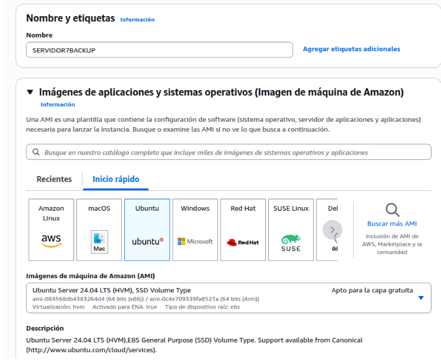

---

# 🔐 Reglas de seguridad para Duplicati

Se muestran las reglas de grupo de seguridad para acceder vía **SSH** y al puerto web de **Duplicati**.

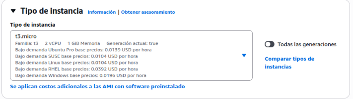

---

# 🔄 Actualización del sistema y dependencias

## Hago un update

```bash
sudo apt update
```

## Instalo el mono runtime

```bash
sudo apt install mono-runtime -y
```

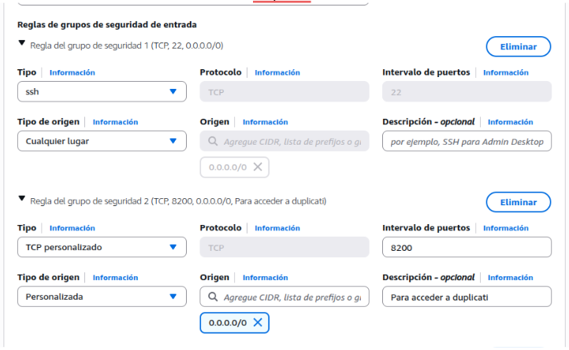

---

# 📦 Instalación del servicio Duplicati

## Descargo el duplicati

```bash
wget https://updates.duplicati.com/beta/duplicati_2.0.6.3-1_all.deb
```

## Descomprimo el archivo

```bash
sudo dpkg -i --ignore-depends=libappindicator1 duplicati_2.0.6.3-1_all.deb
```

## Instalo el Duplicati

```bash
sudo apt install net-tools -y
```

## Edición del archivo de configuración del servicio

```bash
sudo nano /etc/systemd/system/duplicati.service
```

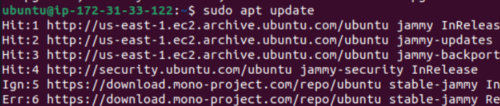

---

# ⚙️ Comprobación del servicio

## Vemos que funciona y que el servicio está en marcha

```bash
sudo systemctl daemon-reload
sudo systemctl enable duplicati
sudo systemctl start duplicati
sudo systemctl status duplicati
```

## Podemos usar el servicio desde la web

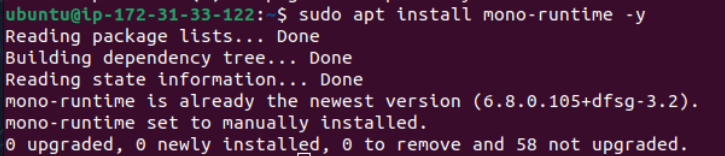

---

# 🔁 Prueba de copia de seguridad

## Parámetros generales

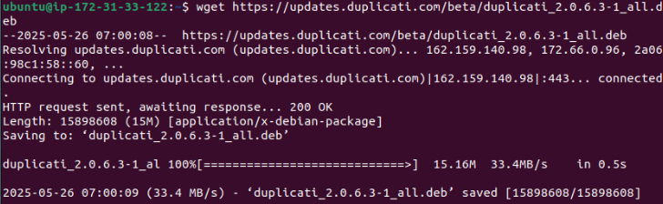

---

## Creamos el directorio para guardar la copia

```bash
sudo mkdir -p /tmp/duplicati-test
ls -lh /tmp/duplicati-test
```

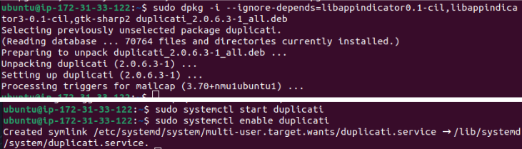

---

## Escogemos el destino y probamos la conexión

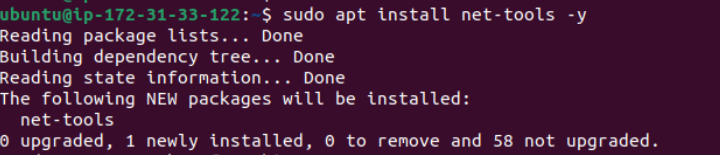

---

## Escogemos los datos de origen

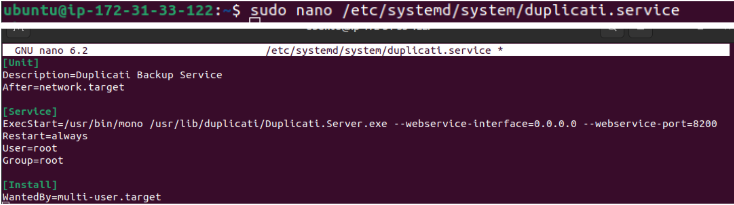

---

## Programamos la planificación de backups

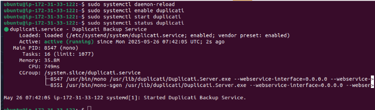

---

## Definimos el tamaño del volumen y la política de retención

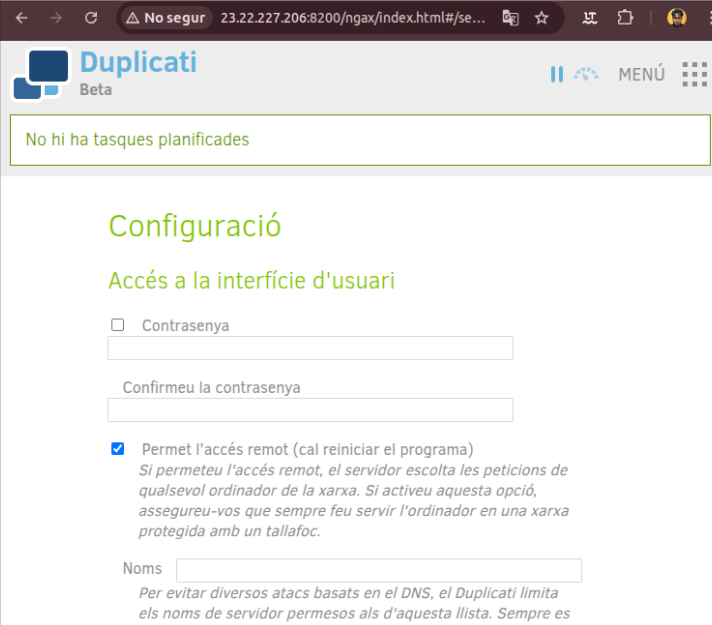

---

# ✅ Validación de la copia de seguridad

Ya está bien configurado el backup, ahora podemos ver que funciona porque aparece la próxima copia programada.  
También podemos **forzar una copia manualmente**.

## Copia programada a las 13:00

## Ejecución manual y comprobación

```bash
ls -lh /tmp/duplicati-test
```


