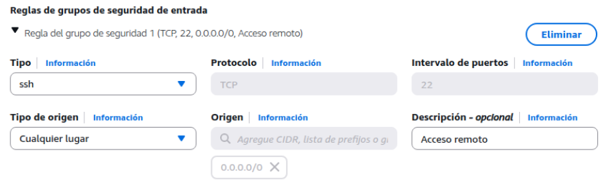
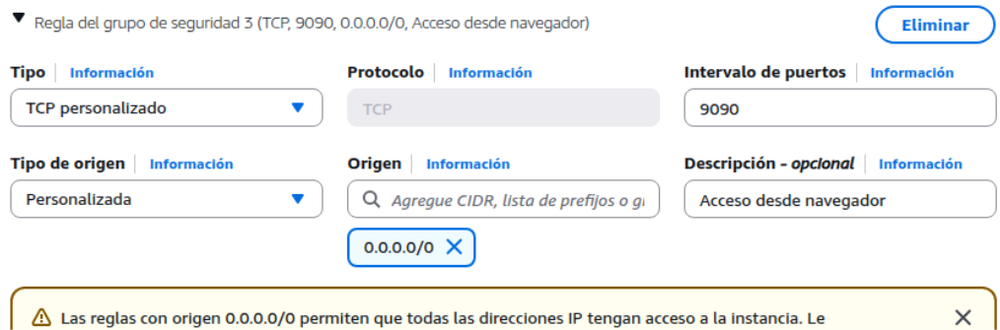
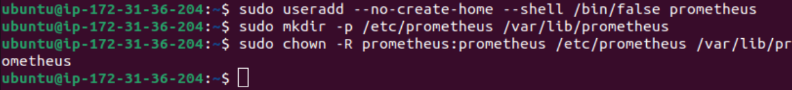
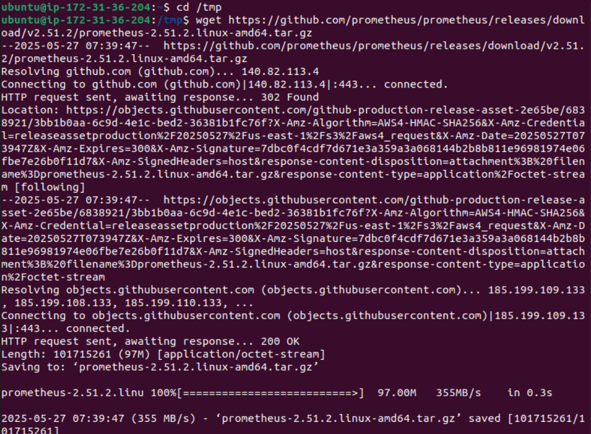
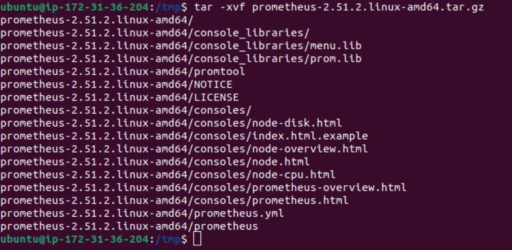
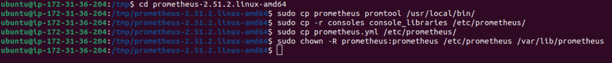
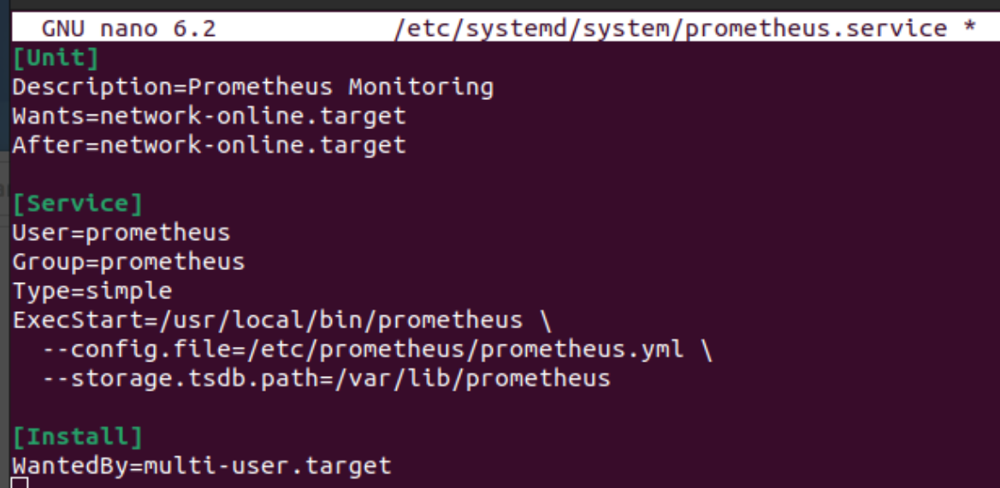
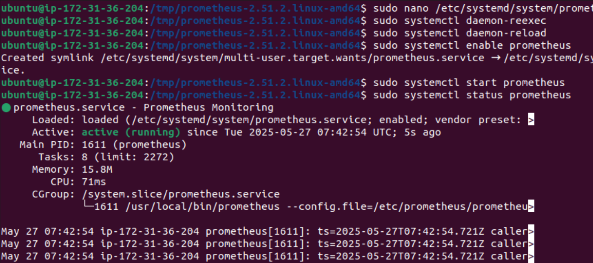

# 📈 Explicación rápida de Prometheus

Prometheus es una herramienta de alerta y supervisión pensada para tomar mediciones a tiempo real de sistemas, servidores, contenedores, bases de datos y aplicaciones.

Recopila métricas como:

- Consumo de CPU  
- Memoria RAM  
- Espacio de disco duro  
- Solicitudes HTTP  
- Estado de los servicios  
- Latencias  

Prometheus sirve para:

- Supervisar servicios y servidores de manera ininterrumpida  
- Detectar fallos o caídas rápidamente  
- Analizar patrones de uso (carga, tráfico, rendimiento)  
- Tomar decisiones basadas en datos (optimización de recursos)



---

# ⚙️ Configuración de la instancia

Se muestran las reglas de grupo de seguridad para acceder vía SSH y al puerto web de Prometheus.



---

# 🛠️ Instalación de Prometheus

## 👤 Creo usuario Prometheus y sus carpetas

```bash
sudo useradd --no-create-home --shell /bin/false prometheus  
sudo mkdir /etc/prometheus /var/lib/prometheus  
sudo chown -R prometheus:prometheus /etc/prometheus /var/lib/prometheus  
```

## 📥 Descargo Prometheus

```bash
cd /tmp  
wget https://github.com/prometheus/prometheus/releases/download/v2.51.2/prometheus-2.51.2.linux-amd64.tar.gz  
```

## 📦 Lo instalo

```bash
tar -xvzf prometheus-2.51.2.linux-amd64.tar.gz  
```



---

# 🧩 Configuración final y creación del servicio

## ✏️ Creo y edito el archivo del servicio de Prometheus

Ruta del archivo: `/etc/systemd/system/prometheus.service`

```ini
[Unit]
Description=Prometheus Monitoring
Wants=network-online.target
After=network-online.target

[Service]
User=prometheus
Group=prometheus
Type=simple
ExecStart=/usr/local/bin/prometheus \
  --config.file=/etc/prometheus/prometheus.yml \
  --storage.tsdb.path=/var/lib/prometheus

[Install]
WantedBy=multi-user.target
```

## ▶️ Activamos y comprobamos que funciona

```bash
sudo systemctl daemon-reexec
sudo systemctl daemon-reload
sudo systemctl start prometheus
sudo systemctl status prometheus
```



---

# 🌐 Acceso desde navegador

Prometheus se muestra correctamente accediendo desde el navegador.



---

# 🧪 Ejecución de comandos para ver métricas

## ⌛ Tiempo de ejecución de una consulta:

Comando:

```prometheus
prometheus_engine_query_duration_seconds
```



---

## 📊 Número de series activas en memoria:

Comando:

```prometheus
prometheus_tsdb_head_series
```



---

## 🧩 Número de "chunks" de datos en la base de datos:

Comando:

```prometheus
prometheus_tsdb_head_chunks
```


